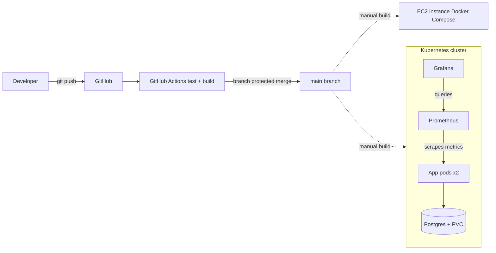

# CloudNotes — Production-Grade DevOps Pipeline

A Flask + PostgreSQL notes API, built as an end-to-end DevOps learning project covering the full lifecycle: version control, containerization, CI/CD, infrastructure as code, container orchestration, and observability.

## Architecture



## Tech stack

| Layer | Tools |
|---|---|
| Application | Python, Flask, PostgreSQL |
| Containerization | Docker, Docker Compose |
| CI/CD | GitHub Actions, branch protection |
| Infrastructure as Code | Terraform (AWS EC2, Security Groups) |
| Orchestration | Kubernetes (Minikube), Deployments, Services, Secrets, PersistentVolumeClaims |
| Monitoring | Prometheus, Grafana |
| Cloud | AWS (EC2, IAM) |

## Features

- REST API for notes (create, list, delete) with a `/health` endpoint for readiness checks
- Multi-container local development via Docker Compose with Postgres healthchecks
- Automated CI pipeline: every PR runs tests and a Docker build; merges to `main` are blocked unless checks pass
- Infrastructure provisioned via Terraform (EC2 instance, security groups)
- Kubernetes manifests for the app, database, and monitoring stack, with credentials stored in Kubernetes Secrets and database storage backed by a PersistentVolumeClaim
- Live metrics (request rate, latency, status codes) exposed via `prometheus-flask-exporter` and visualized in a Grafana dashboard

## Repository structure

```
.
├── app.py                  # Flask application
├── requirements.txt
├── Dockerfile
├── docker-compose.yml
├── tests/                  # pytest unit tests
├── .github/workflows/      # CI pipeline
├── terraform/              # AWS infrastructure as code
└── k8s/                    # Kubernetes manifests
    ├── app.yaml
    ├── postgres.yaml
    ├── prometheus.yaml
    └── grafana.yaml
```

## Running locally (Docker Compose)

```bash
docker compose up -d --build
curl http://localhost:5000/health
```

## Running on Kubernetes (Minikube)

```bash
minikube start --driver=docker
minikube image build -t cloudnotes:v1 .

kubectl create secret generic cloudnotes-db-secret \
  --from-literal=POSTGRES_USER=cloudnotes \
  --from-literal=POSTGRES_PASSWORD=devpassword123 \
  --from-literal=POSTGRES_DB=cloudnotesdb

kubectl create secret generic grafana-secret \
  --from-literal=GF_SECURITY_ADMIN_PASSWORD=admin123

kubectl apply -f k8s/
minikube service cloudnotes-app --url
```

## Provisioning cloud infrastructure (Terraform)

```bash
cd terraform
terraform init
terraform plan
terraform apply
```

## Monitoring

Prometheus scrapes `/metrics` from the app every 15 seconds. Grafana connects to Prometheus internally (`http://prometheus:9090`) and visualizes request rate, latency, and error counts.

## What I learned

This project involved real, hands-on debugging beyond following a tutorial:

- Diagnosed and fixed a Postgres startup race condition using Docker healthchecks
- Resolved an immutable-attribute Terraform replacement (AMI, SSH key pair) that required understanding AWS instance launch-time constraints
- Fixed a Kubernetes Pod ephemeral-storage bug by implementing a PersistentVolumeClaim after losing database state on a Pod restart
- Moved all plaintext credentials (Postgres, Grafana) into Kubernetes Secrets
- Practiced enforced, PR-gated Git workflows with branch protection and required CI status checks

## License

MIT
